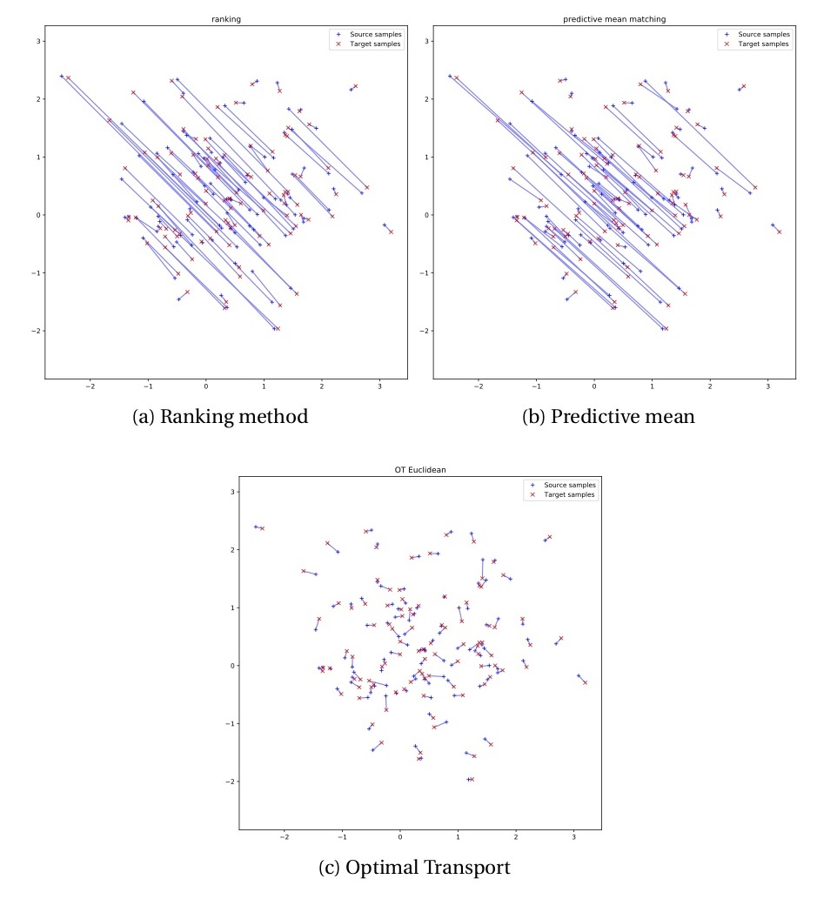

# optimalTransportMatching

This set of programs reproduces the findings in my paper "Matching Data using Optimal Transportation Theory" (Arnoud, 2018).

The synthetic dataset and the figures are created with a python program and the python opt module, made available by Flamary and Courty (2017).

The economic application uses the R transport module, written by D. Schumacher. The data used are the CPS, the SCF (both publicly available) and the SOI (available upon request to the IRS).

